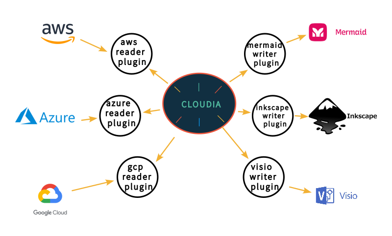

# Cloudia

Cloud Infrastructure Abstraction. Cloudia reads clouds and will write diagrams.

**WARNING WIP** application and documentation will change.

Currently Cloudia is just a fork of CloudMapper. The ambition of the Cloudia
project is to serve as man in the middle between Cloud Platforms and Diagram
authoring applications.



Star us and keep following the project. If you just want a working version of
CloudMapper, have a look at our [cloudmapper-flake-fork](https://github.com/wearetechnative/cloudmapper-flake).

## Usage

First read general [Setup](#setup) documentation.

### nix develop

Open the development shell.

```bash
nix develop github:wearetechnative/cloudia
```

You can now run `python Cloudia [command]` e.g. `python Cloudia collect`

## Supported commands

Not all commands are working because not all python modules are backported.
These commands has been tested to function correctly.

- collect
- configure
- prepare
- webserver

# Commands

- `collect`: Collect metadata about an account. More details
  [here](https://summitroute.com/blog/2018/06/05/cloudmapper_collect/).
- `prepare`/`webserver`: See [CloudMapper Writer](docs/cloudmapper/README.md)

If you want to add your own private commands, you can create a
`private_commands` directory and add them there.

# Screenshot or CloudMapper Writer Plugin


# Installation

- [Install on Linux or macOS](docs/install.md)

## Run with demo data

A small set of demo data is provided.  This will display the same environment
as the demo site https://duo-labs.github.io/cloudmapper/ 

```
# Generate the data for the network map
python cloudia.py prepare --config config.json.demo --account demo
python cloudia.py webserver
```

This will run a local webserver at http://127.0.0.1:8000/
View the network map from that link, or view the report at
http://127.0.0.1:8000/account-data/report.html

# Setup

1. Configure information about your account.
2. Collect information about an AWS account.

## 1. Configure your account

Copy the `config.json.demo` to `config.json` and edit it to include your
account ID and name (ex. "prod"), along with any external CIDR names. A CIDR is
an IP range such as `1.2.3.4/32` which means only the IP `1.2.3.4`.

## 2. Collect data about the account

This step uses the CLI to make `describe` and `list` calls and records the json
in the folder specified by the account name under `account-data`.

### AWS Privileges required

You must have AWS credentials configured that can be used by the CLI with read
permissions for the different metadata to collect.  I recommend using
[aws-vault](https://github.com/99designs/aws-vault).  Cloudia will collect
IAM information, which means you MUST use MFA.  Only the `collect` step
requires AWS access.

You must have the following privileges (these grant various read access of
metadata):

- `arn:aws:iam::aws:policy/SecurityAudit`
- `arn:aws:iam::aws:policy/job-function/ViewOnlyAccess`

### Collect the data

Collecting the data is done as follows:

```
python cloudia.py collect --account my_account
```

## Create the Cytoscape Diagram 
From here, try running the different commands, such as:

```
python cloudia.py prepare --account my_account
python cloudia.py webserver
```

Then view the report in your browser at http://127.0.0.1:8000/account-data/report.html

## Further configuration

### Generating a config file

Instead of modifying `config.json` directly, there is a command to configure
the data there, in case that is needed:

```
python cloudia.py configure {add-account|remove-account} --config-file CONFIG_FILE --name NAME --id ID [--default DEFAULT]
python cloudia.py configure {add-cidr|remove-cidr} --config-file CONFIG_FILE --cidr CIDR --name NAME
```

This will allow you to define the different AWS accounts you use in your
environment and the known CIDR IPs.

If you use [AWS Organizations](https://aws.amazon.com/organizations/), you can
also automatically add organization member accounts to `config.json` using:

```
python cloudia.py configure discover-organization-accounts
```

You need to be authenticated to the AWS CLI and have the permission
`organization:ListAccounts` prior to running this command.
